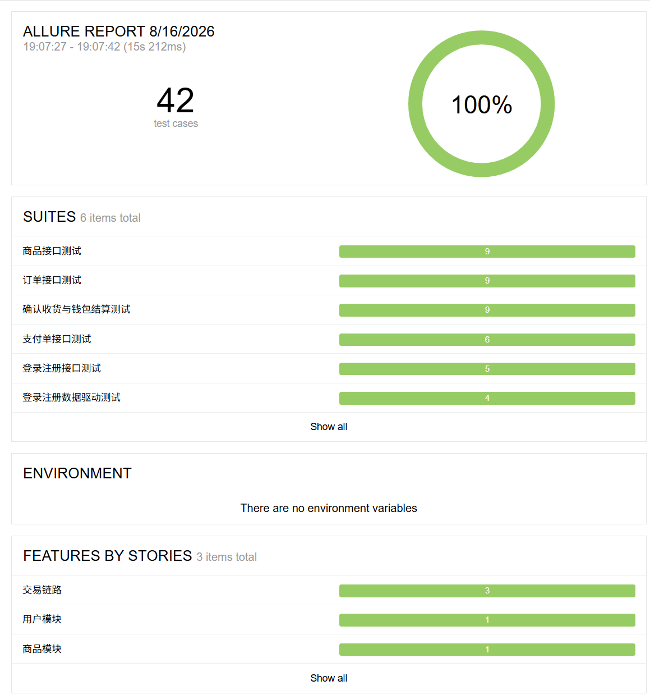
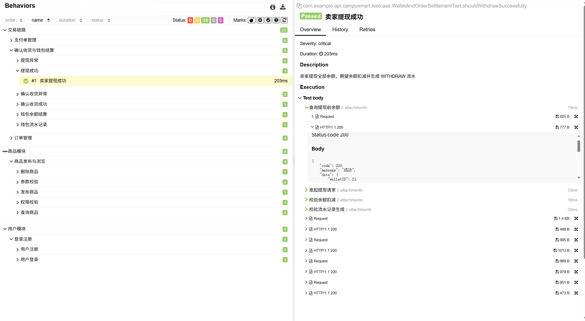
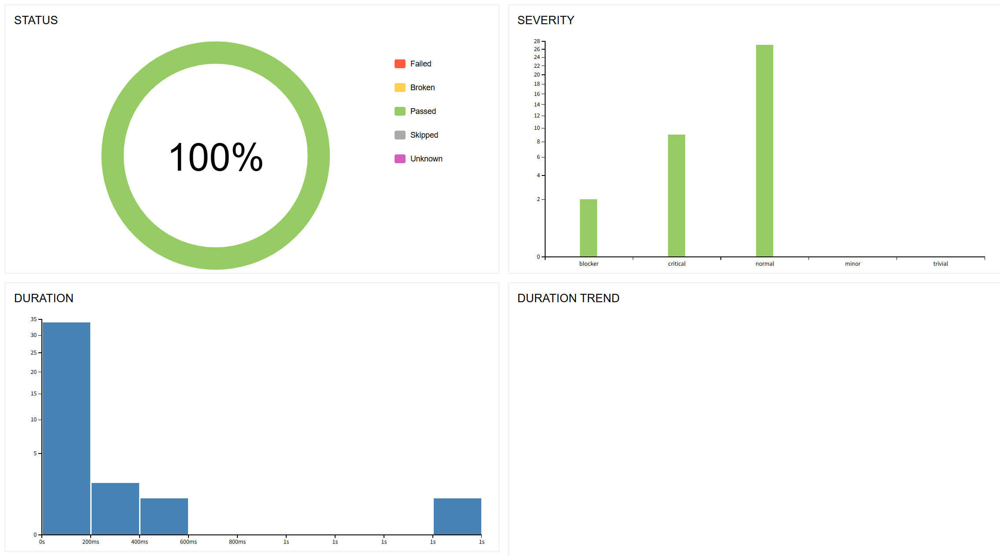
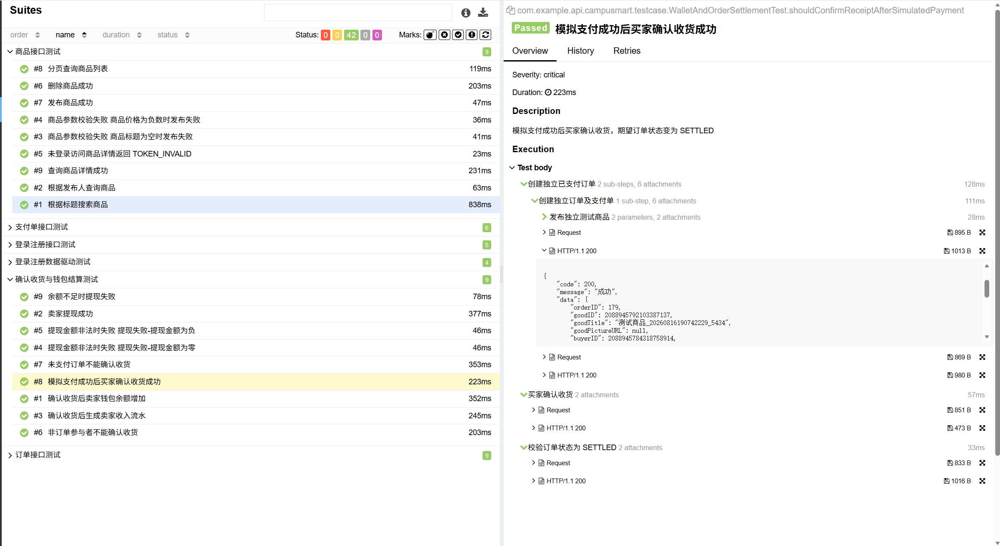
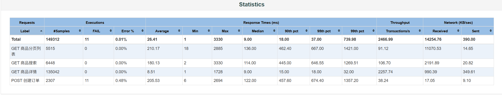
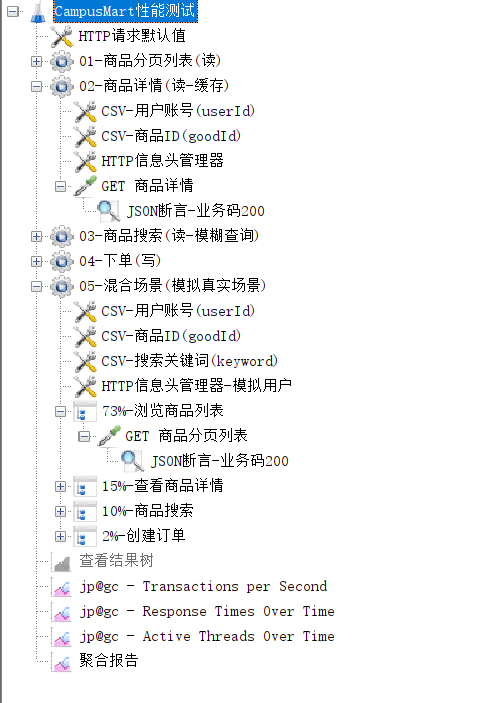

# API-Automation-Testing-Platform 接口自动化测试项目

> 面向 Spring Boot 后端服务的接口自动化测试项目，覆盖核心链路：登录注册、商品发布、订单创建、支付、确认收货、钱包结算。  
> 采用 JUnit 5 + REST Assured + Allure 构建，结合 MyBatis-Plus 实现灰盒测试与测试数据清理。

---

## 一、项目简介

本项目是为 [CampusMart2.0](https://github.com/Ke1logG/CampusMart2.0) 后端编写的独立接口自动化测试工程，旨在通过真实 HTTP 调用验证关键业务接口的正确性，同时借助数据库直接操作完成支付模拟与数据清理。

### 核心目标

- **链路覆盖**：从用户注册到支付完成，覆盖完整交易链路。
- **稳定性**：每个测试类使用独立测试账号，状态变更类用例在方法内创建独立数据，避免用例间污染。
- **可维护性**：API 层与后端接口一一对应，DTO、错误码、工具类分层清晰。
- **可观测性**：Allure 报告按 Epic / Feature / Story / Severity / Description 统一分类，便于定位问题。
- **性能验证**：通过 JMeter 多场景压测评估接口性能特征，定位缓存与无缓存路径的吞吐差异。

---  

  
## 二、报告示例

### 2.1 报告总览

报告首页展示测试执行时间、用例总数、通过率以及按测试套件和 Epic 维度统计的分布情况。共 **42 条**用例，通过率 **100%**。

<p align="center">
  
</p>

### 2.2 功能分层（Behaviors）

左侧按 `Epic → Feature → Story` 层级展示用例，右侧展示选中用例的详细步骤。下图以「卖家提现成功」为例。

<p align="center">
  
</p>

### 2.3 测试图表

图表页从状态、严重等级、执行耗时等维度对测试结果进行可视化统计。

<p align="center">
  
</p>

### 2.4 用例详情

用例详情页自动附加每个 HTTP 请求的请求参数、响应体和状态码（通过 `AllureRestAssured` 过滤器自动采集）。

<p align="center">
  
</p>

---

## 三、技术栈

| 层级 | 技术 | 说明 |
|------|------|------|
| 测试框架 | JUnit 5 | `@Test`、`@BeforeAll`、`@ParameterizedTest` 等 |
| HTTP 调用 | REST Assured 5.4.0 | 封装统一请求规范与 Token 注入 |
| 断言 | AssertJ 3.25.3 | 提升可读性 |
| 报告 | Allure 2.25.0 | 结构化测试报告，自动附加请求响应 |
| 数据库 | MyBatis-Plus 3.5.5 + MySQL 8 | 灰盒测试：状态校验、数据准备、脏数据清理 |
| Spring 容器 | Spring Boot Test 3.2.0 | 测试启动时加载 Spring 上下文，注入 Mapper/Service |
| 工具 | Lombok、JWT、Jackson、Logback | 减少重复代码，解析 Token，序列化响应 |
| 性能测试 | JMeter 5.6.3 | 多场景接口压测、报告 |

---

## 四、项目结构

```text
src/test/java/com/example/api/campusmart/
├── api/                    # HTTP 接口封装层（与后端接口一一对应）
│   ├── AuthApi.java
│   ├── GoodsApi.java
│   ├── OrderApi.java
│   ├── PaymentApi.java
│   └── WalletApi.java
├── common/
│   └── ResultCode.java     # 后端错误码枚举，统一断言
├── config/
│   └── TestConfig.java     # REST Assured 全局配置、baseURI、Allure 过滤器
├── context/
│   ├── AccountContext.java # ThreadLocal 多用户上下文
│   └── TestAccount.java    # 测试账号模型
├── datadriven/             # 数据驱动测试模型
│   └── model/
│       └── LoginFailedCase.java
├── db/                     # 数据库层（灰盒测试支撑）
│   ├── entity/             # 与后端对应的数据库实体
│   ├── mapper/             # MyBatis-Plus Mapper
│   ├── service/            # 数据库操作与测试数据清理服务
│   └── MyBatisPlusConfig.java
├── dto/                    # 请求/响应 DTO
│   ├── goods/
│   ├── trade/
│   ├── LoginRequest.java
│   ├── RegisterRequest.java
│   └── Result.java
├── testcase/               # 测试用例
│   ├── BaseTest.java       # 所有测试类基类：账号准备、数据清理
│   ├── AuthApiTest.java
│   ├── AuthDataDrivenTest.java    # 登录失败 JSON 数据驱动示例
│   ├── GoodsApiTest.java
│   ├── OrderApiTest.java
│   ├── PaymentApiTest.java
│   └── WalletAndOrderSettlementTest.java
└── util/
    ├── JwtUtil.java        # Token 解析工具类
    └── RandomUtil.java     # 随机测试数据生成工具类

src/test/resources/
├── application.properties           # 通用配置
├── application-local.properties     # 本地数据库配置
├── junit-platform.properties        # JUnit 5 显示名称生成器
└── cases/
    └── auth/
        └── login_failed_cases.json  # 登录失败数据驱动用例数据
```

---
  

## 五、测试设计亮点

### 5.1 接口封装层与后端一一对应

每个 `*Api.java` 对应后端一个业务模块，负责构造 HTTP 请求、处理参数、反序列化响应。测试类只关注业务断言，不直接处理请求细节。

```java
// 示例：封装带 Token 的请求
public static Result<OrderVo> createOrder(String token, Long goodId) {
    return TestConfig.givenWithToken(token)
            .queryParam("goodId", goodId)
        .when()
            .post("/app/orders/create")
        .then()
            .statusCode(200)
            .extract()
            .as(new TypeRef<Result<OrderVo>>() {});
}
```

### 5.2 ThreadLocal 实现多用户隔离

`AccountContext` 基于 `ThreadLocal` 保存当前测试类的卖家、买家账号，确保：

- **测试类之间隔离**：每个类 `@BeforeAll` 随机注册新账号。
- **测试类内部共享**：同一类中的用例共享 Token，减少重复登录。
- **并发安全**：线程级隔离，未来可扩展并行执行。

### 5.3 灰盒测试：接口 + 数据库双校验

项目并非纯黑盒测试，而是在关键节点直接操作数据库：

- **模拟支付成功**：绕过真实支付宝回调，通过 `PaymentDbService` 直接将支付单状态改为 `PAID`。
- **数据清理**：`TestDataCleanupService` 按用户 ID 删除 `wallet_flows → user_wallets → payments → orders → goods → user`，保证环境干净。

### 5.4 独立测试数据，避免状态污染

对于创建、取消、确认收货、提现等会变更状态的用例，每个测试方法内部都会：

1. 重新发布商品；
2. 重新创建订单/支付单；
3. 执行操作并断言；

不依赖 `@BeforeAll` 准备的共享数据，避免后端幂等返回或状态机冲突导致用例失败。

### 5.5 数据驱动测试

项目使用两种数据驱动方式：

1. **CSV 参数化**：使用 `@ParameterizedTest` + `@CsvSource` 对相似异常场景进行参数化，例如：

   - 登录失败：用户名/密码错误、用户不存在；
   - 商品参数校验：空标题、负价格；
   - 提现金额非法：0、负数。

2. **JSON 文件驱动**：将规律性较强的接口用例数据抽离到 JSON 文件，测试代码只负责读取和断言。例如登录失败场景的数据存放在 `src/test/resources/cases/auth/login_failed_cases.json`，新增失败用例只需修改数据文件，无需改动 Java 代码。

### 5.6 Allure 报告统一分类

每个测试类和方法都标注了：

- `@Epic`：大模块（用户模块、商品模块、交易链路）；
- `@Feature`：子模块（登录注册、商品发布与浏览、订单管理、支付单管理、确认收货与钱包结算）；
- `@Story`：具体场景；
- `@Severity`：用例优先级；
- `@Description`：操作场景 — 具体行为，期望结果。


---  

## 六、性能测试（JMeter）

在接口自动化之外，使用 JMeter 5.6.3 对被测系统补充多场景性能压测。

### 压测对象与场景

| 接口 | 类型 | 场景 |
|------|------|------|
| 商品详情 /goods/selectById | 读（Redis缓存） | 20/50/100并发 |
| 商品分页 /goods/page | 读（无缓存） | 20/50/100并发 |
| 商品搜索 /goods/search | 读（慢查询） | 20/50/100并发 |
| 创建订单 /orders/create | 写（事务） | 20并发 |
| 混合场景（73%/15%/10%/2% 权重） | 模拟真实用户 | 100线程 |

### 关键指标（20并发轮）

| 指标 | 商品详情（缓存） | 分页/搜索（无缓存） |
|------|:---:|:---:|
| P50 | 9ms | 114~455ms（多场景区间） |
| 吞吐 | 2258 TPS | 91~107 TPS |
| 错误率 | 0% | 读接口0%，下单写接口≤0.5% |

<p align="center">
  
</p>

<p align="center">
  
</p>

### 报告查看方式    

1. 打开 url：[https://ke1logg.github.io/API-Automation-Testing-Platform/](https://ke1logg.github.io/API-Automation-Testing-Platform/) 后按照指引页打开对应轮次测试数据。
2. 直接打开对应轮次：
- 20并发轮：(https://ke1logg.github.io/API-Automation-Testing-Platform/report-20/)
- 50并发轮：(https://ke1logg.github.io/API-Automation-Testing-Platform/report-50/)
- 100并发轮（混合场景）：(https://ke1logg.github.io/API-Automation-Testing-Platform/report-mix2/)

---


## 七、用例分布统计

| 模块 | 接口数 | 用例数 | 参数化用例数 |
|---|---:|---:|---:|
| **Auth** | 2 | 9 | 6 |
| **Goods** | 6 | 8 | 2 |
| **Order** | 6 | 13 | 0 |
| **Payment** | 2 | 6 | 0 |
| **Wallet** | 3 | 4 | 2 |
| **合计** | **19** | **40** | **10** |

> 说明：`WalletAndOrderSettlementTest` 为跨模块链路测试，已按涉及接口拆分到 Order 与 Wallet 模块统计；参数化用例数按 JUnit 实际执行次数计算。

---

## 八、覆盖的业务链路

| 模块 | 测试类 | 核心场景 |
|------|--------|----------|
| 用户模块 | `AuthApiTest` | 注册成功、登录成功、登录失败参数化、用户名重复注册 |
| 商品模块 | `GoodsApiTest` | 发布商品、查询详情、分页查询、标题搜索、按发布人查询、删除商品、参数校验、未登录拦截 |
| 交易链路-订单 | `OrderApiTest` | 创建订单、自购限制、重复创建返回已有订单、查询详情/列表、取消订单、状态机校验、权限校验 |
| 交易链路-支付单 | `PaymentApiTest` | 创建支付单、重复创建、非买家创建限制、非 CREATED 状态限制、取消订单后支付单关闭 |
| 交易链路-确认收货与钱包 | `WalletAndOrderSettlementTest` | 模拟支付后确认收货、卖家余额增加、收入流水生成、未支付确认收货拦截、非参与者拦截、提现成功、余额不足、金额非法 |

总计 **42 条** 用例，覆盖正向、反向、权限、状态机、参数校验等多类场景。

---

## 九、环境准备

### 9.1 启动后端服务

本项目是接口测试工程，需要后端 CampusMart 服务已启动：  

- 被测后端项目：[CampusMart2.0](https://github.com/Ke1logG/CampusMart2.0)  
  
需要配置好后端项目并启动


### 9.2 准备本地配置

在 `src/test/resources/` 下创建 `application-local.properties`：  
1. 需要配置本地数据库连接，并通过后端的sql建表语句创建好数据库  
2. 修改项目连接的端口为后端项目在本地开放的端口（默认8080）
---

## 十、如何运行

1. 启动后端 CampusMart2.0 服务  
2. 终端输入 mvn clean test 运行测试项目  
3. 终端输入 mvn allure:serve 查看allure报告 
  
---


